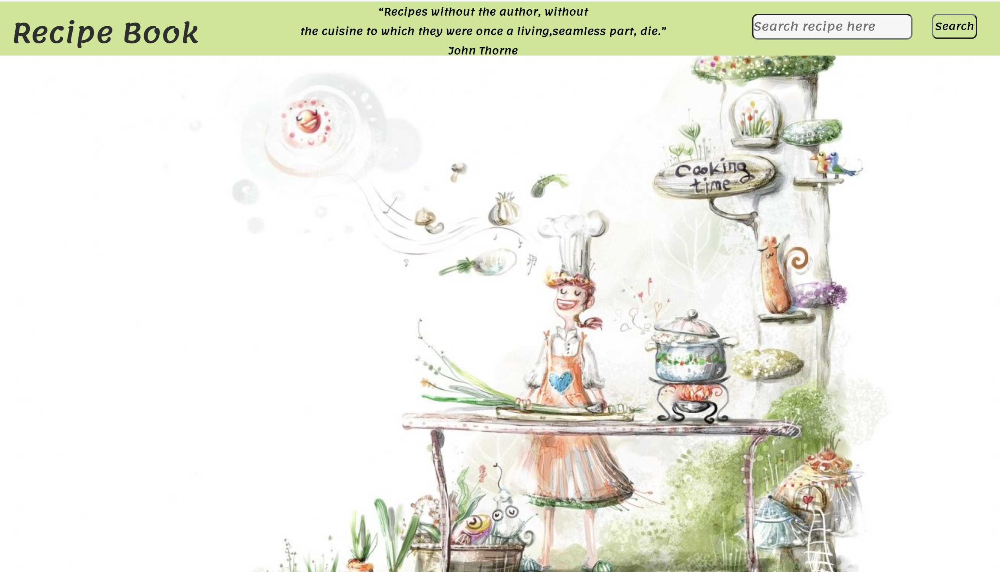
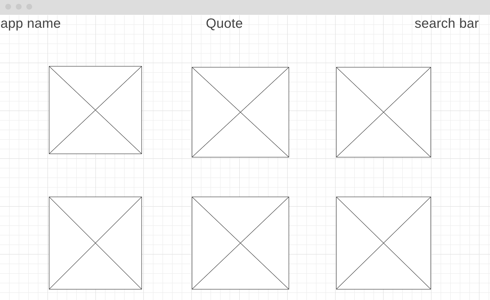

# Food-Recipe-App

**Project Screenshots**

**Technologies used**
Javascript
CSS
HTML
fonts.google.com
TheMealDB

**Installation Instructions**
Search meal by cuisine and see recipe main ingredients and link to the video. 

**User stories**
 As a user, I want to categorize recipes so I can find the recipe of different cuisine. Users are able to search meals by the area where meals from and navigate directly to Youtube to watch videos.  As a mobile and tablet user, I want to see the site formatted correctly for smaller screen sizes. 

**Wireframe**

**Unsolved problems/major hurdles**
Initially, after fetching API for searching, I was planning to implement a feature something like onclick user will be navigated to the page with recipe, similar to other recipe websites I use almost every day, however with recipe API which I chose it was not that easy. Then I thought about adding details of the recipe to the back of each card with meals when the user hovers them cards flip. But I realized that there is no time to figuring out how to implement new things and I have to do something simple which I already know how to implement, like box model. 